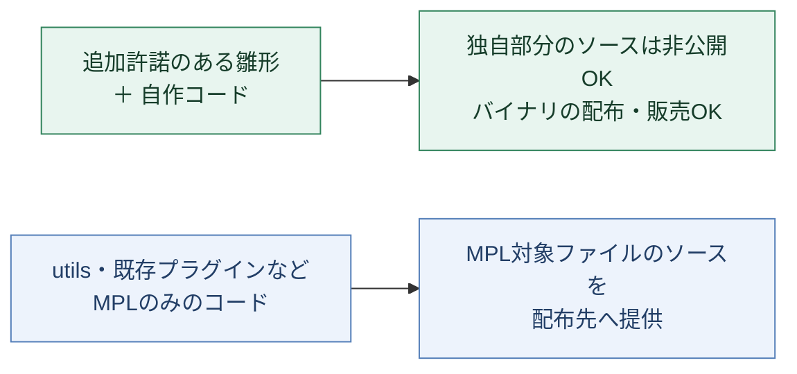
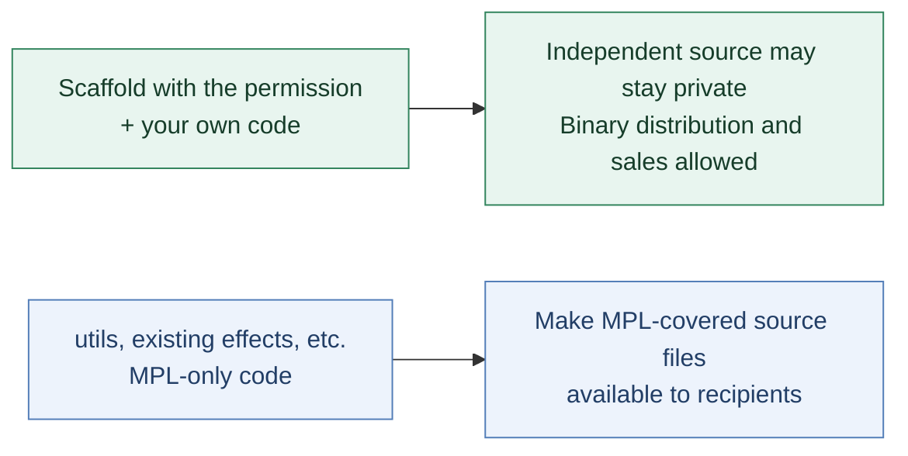

# Licensing / ライセンスの使い分け

本リポジトリのコードは、別途表示されているものを除き [MPL 2.0](LICENSE) です。
指定された生成用コードには、[Template Output Permission](templates/plugin/TEMPLATE-LICENSE.txt) を追加しています。
このページは説明です。利用条件は各ライセンス本文と追加許諾の英文が定めます。

> [!TIP]
> **対象の雛形から作る独自プラグインは、ソース非公開で配布・販売できます。**
> 配布物には `TEMPLATE-LICENSE.txt` 全文を同梱し、組み込む MPL 対象コードや第三者依存の条件も満たしてください。

外部へ配布する場合、ソース提供の範囲はコードの出所によって異なります。



| 利用・配布するもの | 扱い |
| --- | --- |
| 対象の雛形から開発した独自プラグイン | テンプレート由来のコードと同じファイルに独自実装を追加しても、ソース非公開・有償／無償のバイナリ配布が可能です。追加許諾全文を配布物に同梱してください。 |
| 未改変の `utils` を組み込んだプラグイン | 独自部分は非公開にできます。バイナリに含まれる MPL 対象部分の対応ソースを取得可能にし、その方法を配布先に案内してください。 |
| 改変した `utils`、既存プラグインの実装を含む配布物 | 改変した MPL 対象ファイルのソースを MPL で提供してください。元のコードを含まない別ファイルの独自実装まで一律に提供する必要はありません。 |
| テンプレート、生成フック、フレームワーク自体の改良版 | 改良版自体を配布する場合は通常の MPL が適用されます。 |
| 個人・組織内だけでの利用・改良 | 通常、外部へのソース提供は不要です。改良したテンプレートを内部だけで使う場合も同様です。 |

追加許諾は対象ファイルに明示的に許諾された素材に限られます。既存プラグインや `utils` のコードを雛形に移動したり、生成処理を通したりしても対象にはなりません。テンプレートとしての再配布にも、この生成物向け許諾は使えません。第三者のコードはそれぞれの条件に従ってください。

> [!IMPORTANT]
> **ライブラリの呼び出しと、実装のコピーは扱いが異なります。**
> `utils` 等の MPL 限定の実装を独自のソースファイルにコピーした場合、そのファイル全体に通常の MPL の義務が及びます。同じファイル内の独自実装まで非公開にできるとは限りません。

ソース提供の相手は配布先です。GitHub での一般公開や本家への PR は必須ではありませんが、受領者が MPL のもとで再配布できる権利を制限することはできません。未改変のコードへのリンクを使う場合も、配布版と一致するコミット等を指定し、実際に取得できる状態を維持してください。[Mozilla FAQ](https://www.mozilla.org/en-US/MPL/2.0/FAQ/)

## 独自プラグインの作成

外部向けのプラグインを作る場合は、リポジトリのルートから次を実行します。

```sh
cargo generate --path templates/plugin --destination plugins --define repository_plugin=false
```

生成時に作者・カテゴリ・サポート先を設定できます。生成された `TEMPLATE-LICENSE.txt` はテンプレート由来部分の許諾です。初期の Cargo `license-file` もこの雛形の条件を示します。独自コードを追加したら、そのコードに選んだ条件に合わせて `license` または `license-file` を設定し、元の `TEMPLATE-LICENSE.txt` は保持してください。独自コードを MPL で公開する必要はありません。外部用の初期設定は `publish = false` です。

現在の雛形はこの Cargo workspace 内でのビルドを前提にしています。非公開のローカルコピーで `plugins/<name>/` に生成して開発でき、コピー全体を公開する必要はありません。既存の MPL コードと生成した独自コードの境界を保持してください。独立した workspace に移す場合は、workspace 依存、`../../crates/utils`、`../../AdobePlugin.just` の参照も移行する必要があります。

バイナリ配布前に次を整えてください。

- 自作部分の利用条件、作者、About 表示、サポート先、Bundle Identifier、エフェクト名を自分の製品に合わせる。
- **`TEMPLATE-LICENSE.txt` 全文を配布物に含める。** リポジトリへのリンクだけでは、この同梱条件を満たしません。プラグイン名に AOD を付ける義務はありません。
- `utils` 等の MPL 対象部分について、使用した版のソースと取得方法を案内する。改変した場合は、その改変版を提供する。
- 実際に使用した第三者依存のライセンス・著作権表示等も同梱する。生成物への追加許諾は第三者依存の条件を免除しない。

本リポジトリへの追加を予定する場合は `cargo new-plugin` を使ってください。このエイリアスは `repository_plugin=true` を指定し、MPL を継承するパッケージを生成します。外部用として作成した独自実装を投稿する場合も、[投稿条件](CONTRIBUTING.md) に従って MPL で提供してください。生成オプションの切替だけで既存コードの権利や許諾が変わることはありません。

> [!NOTE]
> **更新前に生成済みのプラグインには、自動適用されません。**
> 追加許諾は、それを同梱した版から生成した素材に適用されます。許諾文が付いていない過去版や、その過去版から生成済みのコードに自動的に遡及するものではありません。

## English

Except where separately identified, repository code is licensed under the
[MPL 2.0](LICENSE). The designated scaffold files also carry the
[Template Output Permission](templates/plugin/TEMPLATE-LICENSE.txt).
The license and permission texts govern; this guide explains their use.

> [!TIP]
> **Independent plugins made from the designated scaffold may remain proprietary and be distributed or sold.**
> Include the complete `TEMPLATE-LICENSE.txt` and meet the terms for any MPL-covered code and third-party dependencies you include.

When distributing outside your organization, source availability depends on where the code comes from.



- **Independent plugin output:** you may keep its source private and distribute
  or sell binaries, including after editing the same files as the scaffold.
  Include the complete `TEMPLATE-LICENSE.txt` with distributions containing
  template material. Choose licensing terms for your own code.
- **Shared utilities and existing effects:** the ordinary MPL still applies.
  Make the corresponding MPL source available to recipients and tell them how
  to obtain it, including your changes to covered files. Unchanged MPL code
  also requires corresponding source availability. Separate files containing
  no MPL code may remain proprietary.
- **Template/framework redistribution:** distributing the template, hooks,
  shared libraries or framework as such remains subject to the MPL. Generating,
  moving or renaming excluded code does not bring it within the permission.
- **Private use:** internal changes alone do not require source publication.
  MPL source availability is owed to recipients; a public GitHub repository or
  upstream pull request is not required. Recipients retain their MPL rights.

> [!IMPORTANT]
> **Using a library as a dependency differs from copying its implementation.**
> A file containing MPL-only implementation, such as code copied from utils, is subject to the ordinary file-level MPL obligations arising from that code, even when it also contains template material or independent additions.

For an independent plugin, run the `cargo generate` command above. The template
still depends on this workspace's libraries and build tools; a private local
copy of the workspace is supported. Moving to a standalone workspace also
requires adapting those references. The initial `license-file` describes the
scaffold, not a licensing decision for future independent additions. Update
your package's `license` or `license-file` for your chosen terms and preserve
`TEMPLATE-LICENSE.txt`. A repository link alone does not replace the requirement
to include that entire file. Review your author, category, support URL, effect name,
bundle identifier and distribution notices before release.

For repository contributions, `cargo new-plugin` selects MPL inheritance.
See [CONTRIBUTING.md](CONTRIBUTING.md) for the terms applying to contributed
effect code and template changes. Third-party code retains its own terms.

> [!NOTE]
> **Previously generated plugins are not automatically covered.**
> The permission covers material released with it, not earlier revisions released without it or output previously generated from those revisions.

Official release ZIPs include `LICENSE`, this guide, the template permission,
recorded plugin-specific third-party notices, and `SOURCE.txt` identifying the
source revision. The recorded notices are not a complete dependency license
audit; distributors must account for the dependencies in their actual build.
