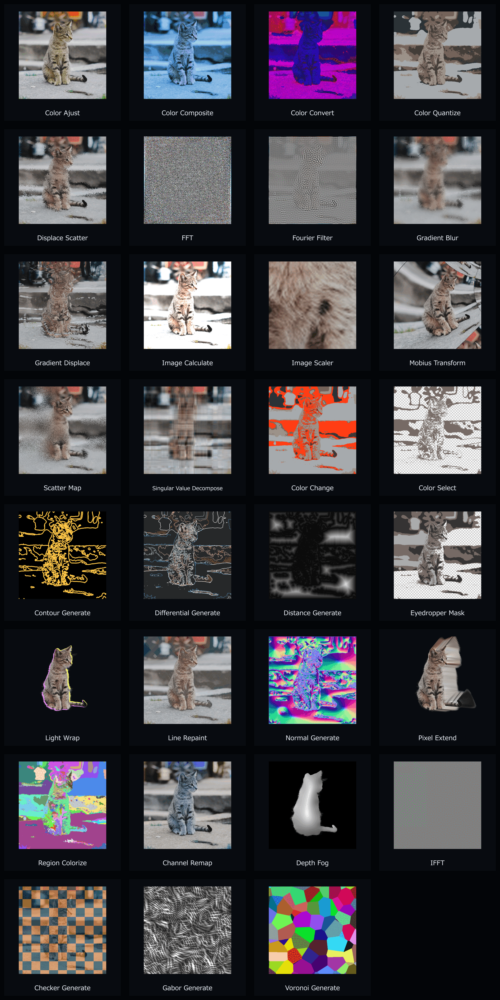

# aod-AE-plugin

[](https://github.com/Aodaruma/aod-AE-plugin/actions/workflows/ci.yml)
[](https://github.com/Aodaruma/aod-AE-plugin/releases/latest)
[](https://github.com/Aodaruma/aod-AE-plugin/releases)
[](https://github.com/sponsors/Aodaruma)

[Aodaruma](https://aodaruma.net/)によって開発された、Rust で書かれた Adobe After Effects プラグイン集です。
複数のAEエフェクトプラグインを、テンプレートを用いて構築・量産、自動でMacOS/Windows向けにビルド・リリースします。

A collection of Adobe After Effects plugins written in Rust, developed by [Aodaruma](https://aodaruma.net/).
This repository is a Cargo
workspace that builds multiple AE effect plugins, plus shared utilities and a plugin
template.

現在のカタログには、写真・アニメ素材・データ画像・生成用途を横断する38種類のエフェクトを収録しています。
The current catalog contains 38 effects for photo, anime, data/map, and generator workflows.

## Effect List / エフェクト一覧

[](docs/catalog/README.md)

- [Catalog Index / カタログ索引](docs/catalog/README.md)
- [P: Photo / 一般写真・連続階調画像](docs/catalog/photo.md)
- [A: Anime / アニメ素材](docs/catalog/anime.md)
- [D: Data & Map / データ・マップ画像](docs/catalog/map-data.md)
- [G: Generator / 生成用キャンバス](docs/catalog/generator.md)
- [Releases / ダウンロード](https://github.com/Aodaruma/aod-AE-plugin/releases)

## 1. Issue / バグ報告

もしバグを見つけた場合は、[Issues](https://github.com/Aodaruma/aod-AE-plugin/issues) ページで報告してください。

If you find a bug, please report it on the [Issues](https://github.com/Aodaruma/aod-AE-plugin/issues).

## 2. Support / 支援

> [!NOTE]
> もしこのプロジェクトが役に立ったら、GitHub Sponsors での支援をご検討ください。  
> If this project helps you, please consider supporting it via GitHub Sponsors.

https://github.com/sponsors/Aodaruma

## 3. License

基本ライセンスは [MPL-2.0](LICENSE) です。指定された雛形から開発する独自プラグインには
[生成用の追加許諾](templates/plugin/TEMPLATE-LICENSE.txt) があり、ソース非公開での配布・販売が可能です。
`utils`、既存プラグインの実装、テンプレート自体の再配布には通常の MPL が適用されます。
具体例と配布時の条件は [ライセンスガイド](LICENSING.md) を参照してください。

Licensed under [MPL-2.0](LICENSE), with a
[Template Output Permission](templates/plugin/TEMPLATE-LICENSE.txt) for designated scaffold material.
Independent plugins may keep their source private and distribute or sell binaries.
Shared utilities, existing effect implementations and template redistribution remain subject to the ordinary MPL.
See [LICENSING.md](LICENSING.md) for scope, source availability and notice requirements.

---

## 4. For Developers / 開発者向け情報

> [!NOTE]
> 以下は開発者向け情報です。利用のみの場合は上部のReleasesを参照してください（英語のみ）。
> 
> The following is for developers. If you only want to use the plugins, see the Releases section above.

### Build and install

Prerequisites:

- Rust toolchain and cargo
- cargo-generate
- just (recommended)

Build all plugins:

```sh
# for debug versions:
just build

# you can also build release versions:
just release
```

> [!WARNING]
> `just build` installs to the Adobe Common Plug-ins folder by default.  
> Skip installation with `NO_INSTALL=1 just build`.

By default the build installs to the Adobe Common Plug-ins folder. To skip installation:

```sh
NO_INSTALL=1 just build
```

Outputs:

- Windows: `target/debug/*.aex` or `target/release/*.aex`
- macOS: `target/debug/*.plugin` or `target/release/*.plugin`

You can also build a single plugin:

```sh
just -f plugins/color-ajust/Justfile build
```

### Create a new plugin

The repo includes a `cargo-generate` template:

```sh
# For an MPL-licensed contribution to this repository:
cargo new-plugin

# For an independent plugin (source may remain private):
cargo generate --path templates/plugin --destination plugins --define repository_plugin=false
```

Both modes include `TEMPLATE-LICENSE.txt`. Independent plugins use configurable
author/category/support information; review the generated README and
[licensing guide](LICENSING.md) before distribution. The template currently
builds within this workspace, including when using a private local copy.

### Repository layout

- `plugins/`: each plugin crate
- `crates/utils/`: shared pixel conversion helpers
- `templates/plugin/`: plugin template for `cargo-generate`
- `tester/`: sample After Effects project for manual testing

### Contribution

Issues and pull requests are welcome. Please keep `cargo fmt` and `cargo clippy` clean when possible.
See [CONTRIBUTING.md](CONTRIBUTING.md) for the MPL contribution terms and the
additional permission required for contributions to the designated scaffold files.
