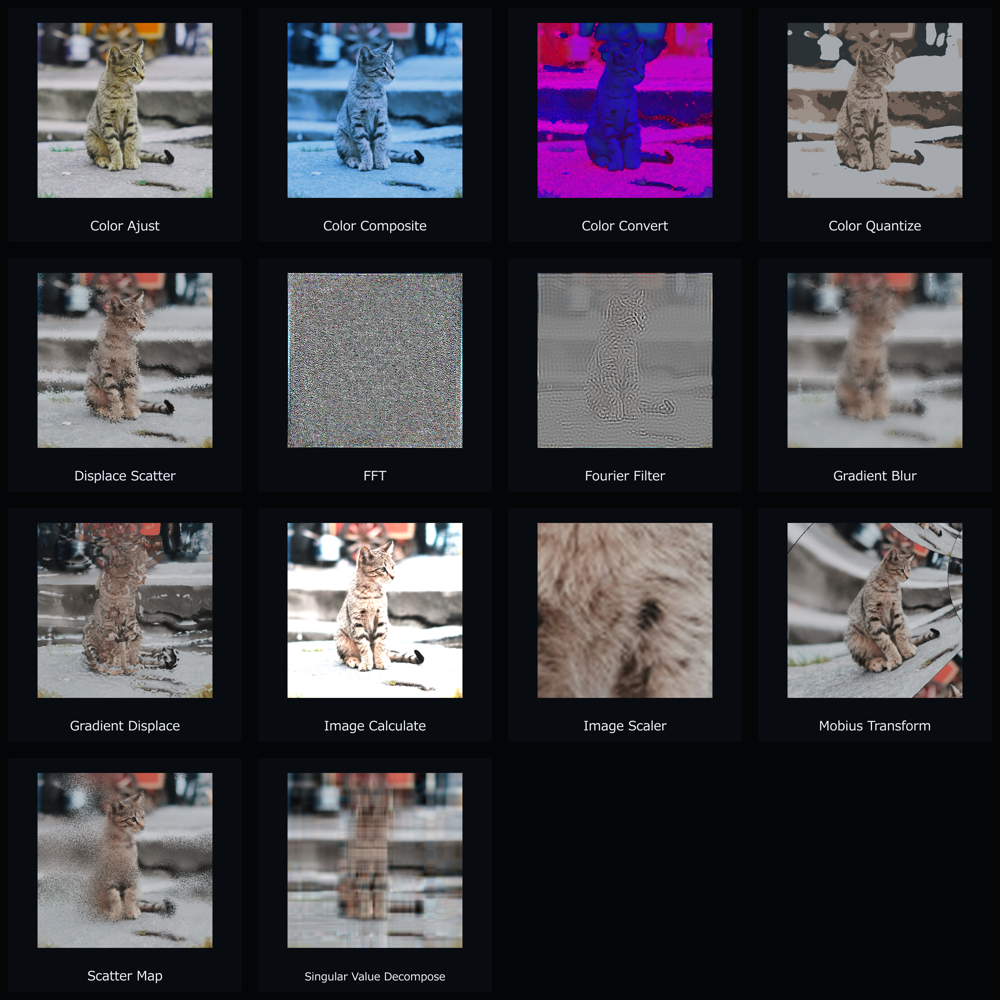
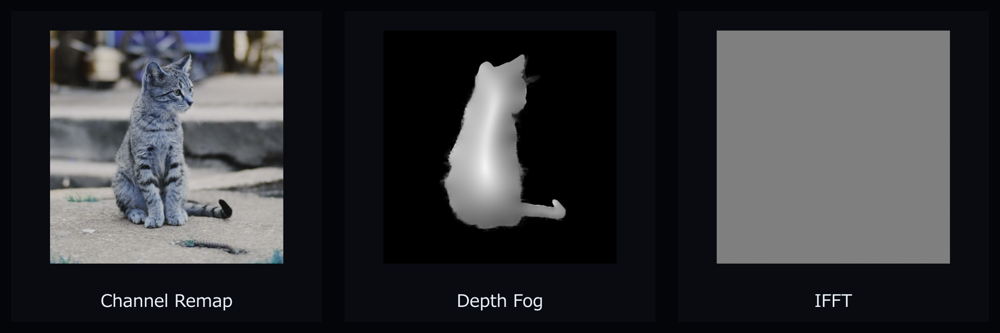
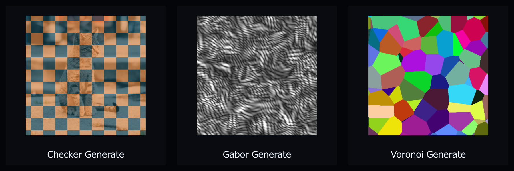

# AOD After Effects Plugin Catalog

用途に合う入力素材からエフェクトを探せるよう、現在のリポジトリに含まれる31プラグインを4分類に整理しています。

| 分類 | 適した素材 | 収録数 | 詳細 |
|---|---|---:|---|
| P | Photo：一般写真・連続階調画像 | 14 | [Photo / 一般画像](photo.md) |
| A | Anime：アニメ素材（セル塗り・線画・透過キャラクター） | 11 | [Anime / アニメ素材](anime.md) |
| D | Data & Map：データ・マップ画像 | 3 | [Data & Map / データ・マップ](map-data.md) |
| G | Generator：生成用キャンバス | 3 | [Generator / 生成系](generator.md) |

分類は「最も分かりやすく効果を確認できる主入力」を示します。たとえば `AOD_ScatterMap` はP分類ですが、Amount Mapなどの補助入力としてD分類の画像を併用できます。

プレビューは効果の違いを見分けやすくするための強調設定で、デフォルト設定とは限りません。写真素材にはEmre Gencer氏のUnsplash写真を加工して使用しています。

## Overview

### P：一般写真・連続階調画像

### A：アニメ素材

### D：データ・マップ画像

### G：生成用キャンバス

