# A：アニメ素材

セル塗り、主線、独立した色領域、透過背景を持つキャラクター素材で効果を確認しやすいエフェクトです。

[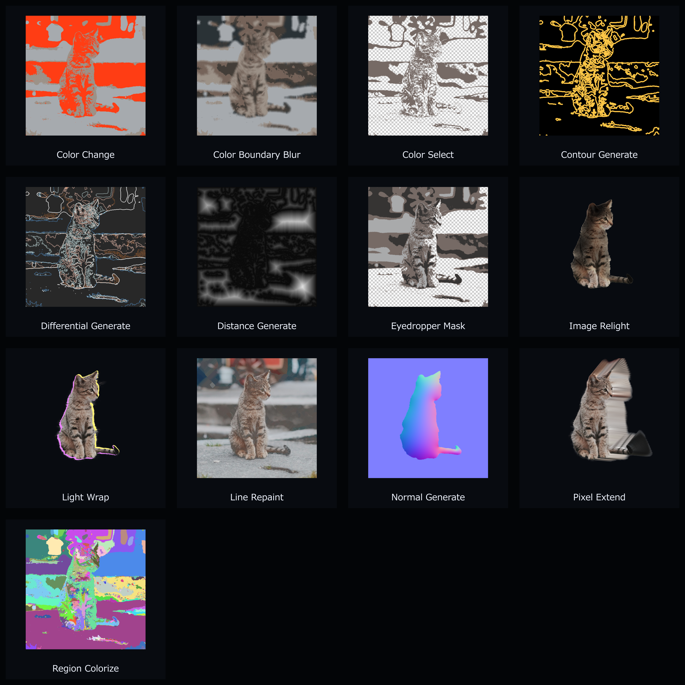](assets/overview/anime.png)

## AOD_ColorChange

- **分類:** A：アニメ素材

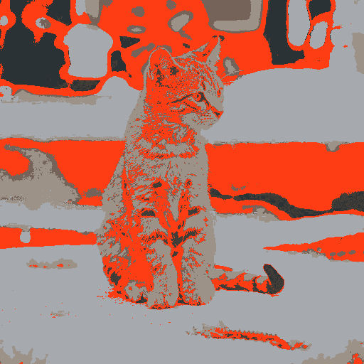

指定色に近い画素を、許容幅付きで別の色へ置換します。

### パラメーター

- `Tolerance`: 元色との一致許容幅を設定します。
- `Number of Colors`、`Add/Remove Color`: 置換ペア数を管理します。
- 各`Color From/To`: 置換元と置換先の色を設定します。

## AOD_ColorBoundaryBlur

- **分類:** A：アニメ素材

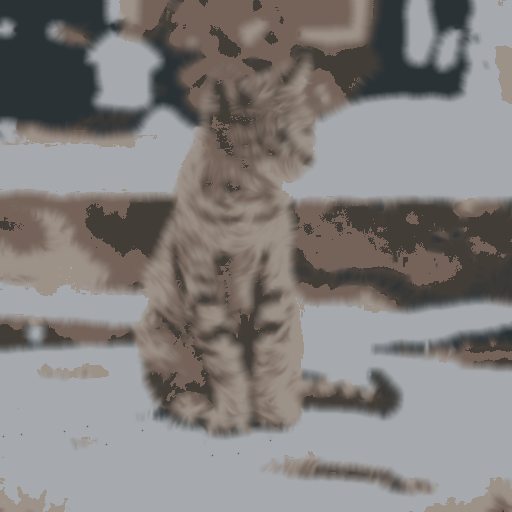

複数の指定色が近接する境界だけを検出し、等方または境界法線方向のブラーでなじませます。

### パラメーター

- `Color Tolerance`、`Minimum Alpha`、`Color Proximity`: 選択色との一致条件と、アンチエイリアス等の短い隙間をまたぐ距離を設定します。
- `Number of Colors`、`Add/Remove Color`、各`Color`: 2～16色の選択色を動的に管理します。
- `Blur Mode`: Box、Gaussian、境界法線方向の異方性ブラーを選択します。
- `Blur Radius`、`Normal Samples`、`Along-Boundary Radius`: ブラー半径、法線方向の品質、接線方向へ広げる量を設定します。
- `Post Smooth`: 法線方向ブラーへ追加のGaussianブラーをかけて筋状の結果をなじませます。
- `Boundary Width`、`Mask Feather`、`Mix`: 適用範囲、境界マスクのぼかし、原画像との混合量を設定します。
- `Edge Mode`、`Preserve Alpha`: 画像端のサンプリングと元アルファの保持を設定します。

## AOD_ColorSelect

- **分類:** A：アニメ素材

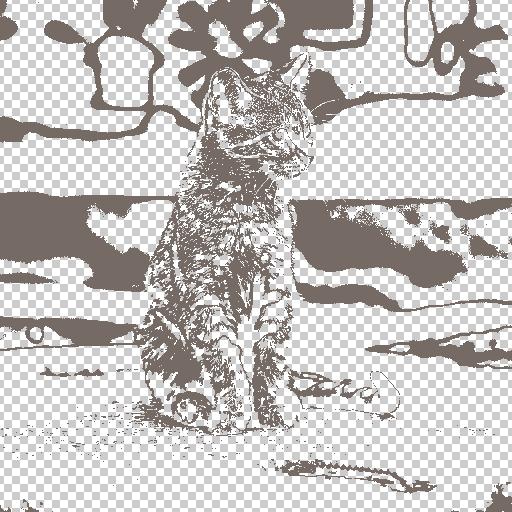

複数の指定色をキーアウトするか、その色だけを保持して領域を選択します。

### パラメーター

- `Keep Selected Colors`: 指定色を残す／除去する動作を切り替えます。
- `Tolerance`: 色差の許容幅を設定します。
- `Number of Colors`、`Add/Remove Color`、各`Color`: 選択色を管理します。

## AOD_ContourGenerate

- **分類:** A：アニメ素材

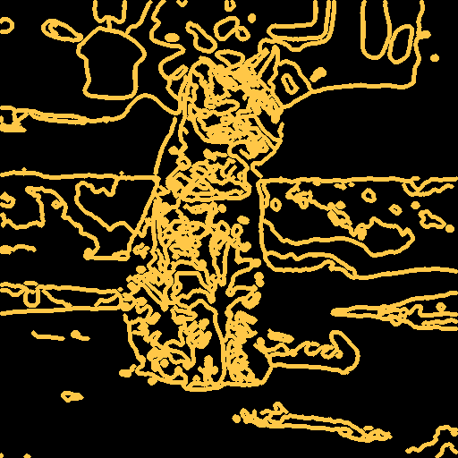

Canny法で色や明度の境界を検出し、輪郭線画像を生成します。

### パラメーター

- `Low/High Threshold`: エッジ検出の弱・強しきい値を設定します。
- `Pre Blur Sigma`: 検出前のノイズ除去量を設定します。
- `Line Width`、`Thin Lines`: 線幅と1px細線化を切り替えます。
- `Line Color`、`Use Alpha`、`Invert`: 線色、アルファ利用、反転を設定します。

## AOD_DifferentialGenerate

- **分類:** A：アニメ素材／D：データ生成

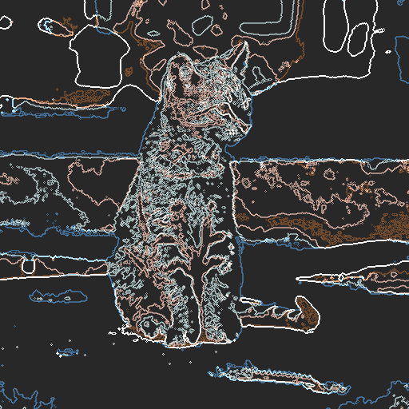

入力画像のX・Y方向差分または勾配強度をRGBA画像として生成します。

### パラメーター

- `Axis`: X、Y、Magnitudeを選択します。
- `Offset`、`Scale`: 差分値を表示・保存するための基準値と倍率です。
- `Out Of Range`、`Edge Mode`: 範囲外値と画像境界の扱いを設定します。
- `RGB Only`、`Raw Mode`: アルファ保持と32bpcの生データ出力を切り替えます。

## AOD_DistanceGenerate

- **分類:** A：アニメ素材／D：データ生成

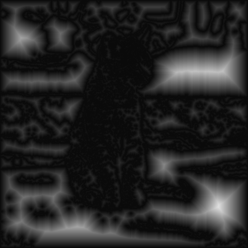

色領域の境界から、内側・外側・符号付きの距離画像を生成します。

### パラメーター

- `Distance Type`: Manhattan、Euclidean、Chebyshev、Lp距離を選択します。
- `Direction`: 内側、外側、符号付き両側を選択します。
- `Lp Exponent`、`Gradient Width`、`Offset`: 距離形状、正規化幅、出力基準を設定します。
- `Alpha Threshold`、`Label Tolerance`: 背景判定と色領域のまとめ方を設定します。
- `Clamp`、`Use Original Alpha`: 32bpc範囲とアルファを制御します。

## AOD_EyedropperMask

- **分類:** A：アニメ素材

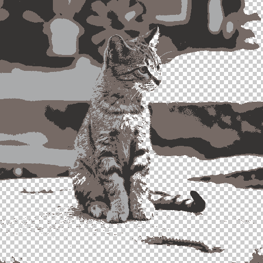

スポイト地点から連結している近似色領域を抽出し、領域ごとに不透明度を調整します。

### パラメーター

- `Color Threshold`、`Alpha Threshold`、`Region Min Alpha`: 領域探索の色・透明度条件を設定します。
- `Alpha Workflow`: プリマルチ／ストレートの処理方式を選択します。
- `Connectivity`: 4近傍／8近傍の連結条件を選択します。
- `Add/Remove Point`と各Point: スポイト位置、対象色、適用不透明度を管理します。

## AOD_LightWrap

- **分類:** A：アニメ素材

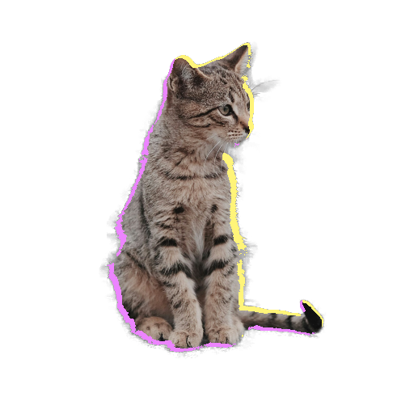

透過キャラクターの境界へ、方向性を持つリムライト／ライトラップを追加します。

### パラメーター

- `Mode`: Alpha Blur DisplaceまたはSDF方式を選択します。
- `Light Color`、`Opacity`、`Direction`: 光の色、量、方向を設定します。
- `Blur Radius`、`Displacement`、`Warp Quality`、`Map Gamma`: Blur方式の広がりと品質を設定します。
- `Radius`、`Falloff`、`Directionality`: SDF方式の距離と減衰を設定します。
- `Mask Layer/Channel`、`Invert Mask`: 外部マスクを指定します。
- `Boundary Blur/Scatter`: 境界のSpread、Blur、Scatter、Samplesを設定します。
- `Blend Mode`、`Preserve Source Alpha`、`Clamp`: 合成と出力を制御します。

## AOD_LineRepaint

- **分類:** A：アニメ素材

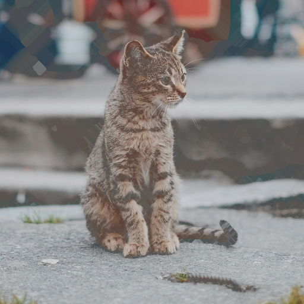

主線色に一致する画素を、周囲の塗り色を伝播させて馴染ませます。

### パラメーター

- `Line Color`、`Tolerance`: 塗り替える線色と許容幅を設定します。
- `Alpha Threshold`: 処理対象とする透明度の下限です。
- `Connectivity`: 色伝播の近傍方式を選択します。
- `Max Iterations`: 伝播回数を設定します。0では自動です。
- `Edge Erosion`: 境界から内側へ処理範囲を調整します。

## AOD_NormalGenerate

- **分類:** A：アニメ素材／D：データ生成

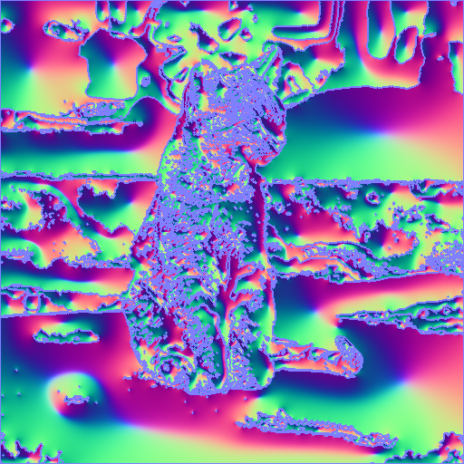

色分けされた領域から、高さの変化を推定した法線マップを生成します。

### パラメーター

- `Method`: SDFまたはPoisson方式を選択します。
- `Normal Strength`、`Invert`、`Flip Y`: 法線強度、凹凸反転、DirectX形式を設定します。`Flip Y`は既定で有効です。
- `Alpha Threshold`、`Label Tolerance`、`Boundary Condition`: 領域と境界の解釈を設定します。
- `Edge Softness`、`SDF Radius/Exponent`: SDF方式の形状を調整します。
- `Poisson Iters`、`Divergence`、`Damping`、`Edge Feather`: Poisson方式の収束と滑らかさを調整します。
- `Use Original Alpha`: 元のアルファを保持します。

## AOD_PixelExtend

- **分類:** A：アニメ素材

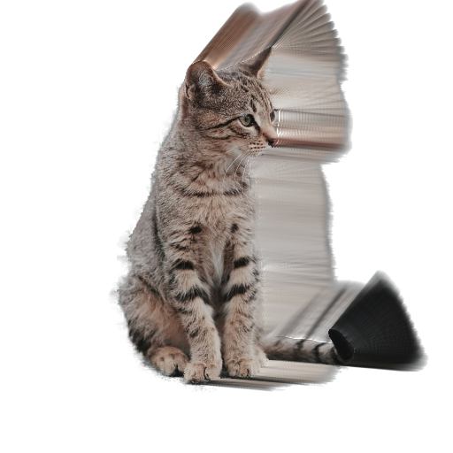

指定条件に一致するピクセルを方向・減衰・補間指定で引き伸ばします。

### パラメーター

- `Direction`、`Extend Count`、`Step Size`、`Offset`: 延長方向、回数、間隔、開始位置を設定します。
- `Direction Map`: 別レイヤーのチャンネルやベクトルから方向を制御します。
- `Decay`、`Angle Change`、`Expansion`: 延長に伴う減衰、曲がり、広がりを設定します。
- `Pixel Detection`: アルファ／色などの基準、しきい値、反転、Softnessを設定します。
- `Interpolation`: 補間方式とMitchell係数を設定します。
- `Show Source`、`Blend Mode`、`Opacity`: 元画像との合成を制御します。

## AOD_RegionColorize

- **分類:** A：アニメ素材

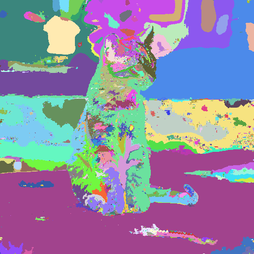

連結した不透明領域または色領域を、ランダム・位置・インデックスで色分けします。

### パラメーター

- `Region Source`、`Tolerance`: 領域判定にアルファまたは色を使い、許容幅を設定します。
- `Mode`: Random、Position、各種Index Gradientを選択します。
- `Seed`: ランダム配色を固定します。
- `Gradient Point`、`Position Center`: 位置基準の配色中心を設定します。
- `Randomness`: 位置・インデックス配色へランダム性を加えます。
- `Use Original Alpha`: 元の透明度を保持します。
