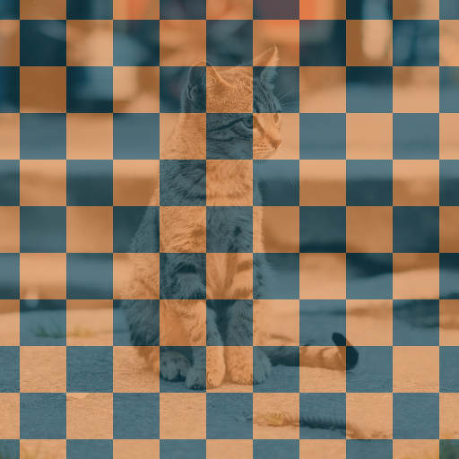
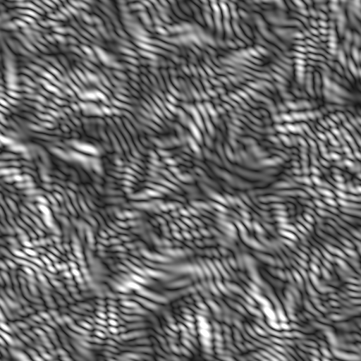
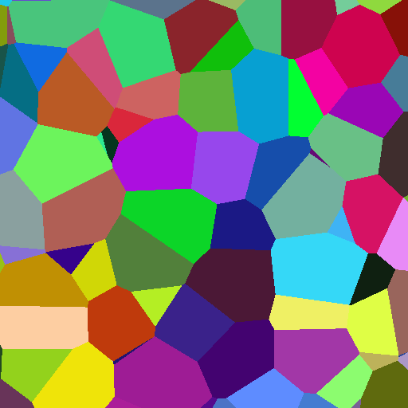

# G：生成用キャンバス

黒・白・透明などの無地レイヤーへ適用し、画像そのものを生成するエフェクトです。

## AOD_CheckerGenerate

- **分類:** G：生成用キャンバス

セルサイズ・色・中心・エッジを調整できる2色のチェッカーボードを生成します。

### パラメーター

- `Separate Width/Height`、`Cell Size/Width/Height`: セルの縦横サイズを設定します。
- `Center`: パターンの基準位置を指定します。
- `Color A/B`、各`Opacity`: 2色と透明度を設定します。
- `Edge Interpolation`、`Apply Feather`、`Feather Width`: セル境界の滑らかさを調整します。
- `Blend Mode`、`Blend Opacity`: 入力画像との合成を設定します。
- `Preserve Original Alpha`、`Clamp`: アルファと32bpc出力を制御します。

## AOD_GaborGenerate

- **分類:** G：生成用キャンバス（補助入力: D）

方向性と周波数を持つBlender風Gaborテクスチャを生成します。

### パラメーター

- `Output`: Value、Phase、Intensityなどの出力種別を選択します。
- `Scale`、`Frequency`、`Anisotropy`と各Map Layer: 模様の密度・周波数・方向性を数値またはマップで制御します。
- `Orientation 2D/3D`: 2D角度または3D方位・仰角を設定します。
- `W`、`Scale W`: 追加次元の座標と倍率を設定します。
- `Offset`、`Seed`: 模様の位置と乱数を設定します。
- `Gain`、`Bias`、`Clamp`: 出力のコントラスト、基準値、範囲を調整します。
- `Use Original Alpha`: 入力レイヤーのアルファを保持します。

## AOD_VoronoiGenerate

- **分類:** G：生成用キャンバス（補助入力: D）

セル位置・距離・色を出力できるVoronoiテクスチャを生成します。

### パラメーター

- `Output`: Color、Position、Distanceを選択します。
- `Mode`: F1、F2、F2−F1、N-Sphere Radiusを選択します。
- `Cell Size`、`Cell Size Map Layer`、`Scale X/Y`: セル密度を数値またはマップで制御します。
- `Randomness`、`Seed`: セル点のばらつきと乱数を設定します。
- `Smoothness`、`Distance Metric`、`Lp Exponent`: 距離場の形状を調整します。
- `W`、`Scale W`、`Offset`: 追加次元と位置を設定します。
- `Blend Mode`、`Blend Opacity`: 入力画像との合成を設定します。
- `Normalize Distance`、`Clamp`、`Use Original Alpha`: 距離の正規化と出力を制御します。
