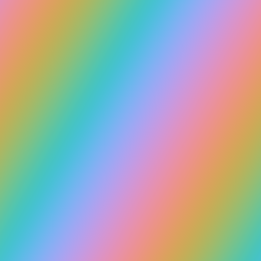

# G：生成用キャンバス

黒・白・透明などの無地レイヤーへ適用し、画像そのものを生成するエフェクトです。

## AOD_CheckerGenerate

- **分類:** G：生成用キャンバス

セルサイズ・色・中心・エッジを調整できる2色のチェッカーボードを生成します。

### パラメーター

- `Separate Width/Height`、`Cell Size/Width/Height`: セルの縦横サイズを設定します。
- `Center`: パターンの基準位置を指定します。
- `Color A/B`、各`Opacity`: 2色と透明度を設定します。
- `Edge Interpolation`、`Apply Feather`、`Feather Width`: セル境界の滑らかさを調整します。
- `Blend Mode`、`Blend Opacity`: 入力画像との合成を設定します。
- `Preserve Original Alpha`、`Clamp`: アルファと32bpc出力を制御します。

## AOD_GaborGenerate

- **分類:** G：生成用キャンバス（補助入力: D）

方向性と周波数を持つBlender風Gaborテクスチャを生成します。

### パラメーター

- `Output`: Value、Phase、Intensityなどの出力種別を選択します。
- `Scale`、`Frequency`、`Anisotropy`と各Map Layer: 模様の密度・周波数・方向性を数値またはマップで制御します。
- `Orientation 2D/3D`: 2D角度または3D方位・仰角を設定します。
- `W`、`Scale W`: 追加次元の座標と倍率を設定します。
- `Offset`、`Seed`: 模様の位置と乱数を設定します。
- `Gain`、`Bias`、`Clamp`: 出力のコントラスト、基準値、範囲を調整します。
- `Use Original Alpha`: 入力レイヤーのアルファを保持します。

## AOD_RainbowGenerate

- **分類:** G：生成用キャンバス

2点アンカーまたは中心・角度から得た座標を、多様な知覚・円筒色空間へ変換して虹を生成します。パラメトリック生成を標準とし、二色補間にも切り替えられます。

### パラメーター

- `Shape`、`Coordinates`: Linear、Reflected Linear、Radial (L2)、Diamond (L1)、Box (L∞)、Minkowski (Lp)、Conic、Spiral、Starburstと、Two Points／Parametric指定を切り替えます。
- `Start/Center`、`End/Radius`または`Center/Angle/Length`: グラデーションの基準座標を設定します。
- `Aspect (-Vertical / +Horizontal)`: `-1..1`の対称値を、縦方向／横方向の対数ストレッチへ変換します。
- `Skew`: 全形状を水平方向へシアー変形します。`0%`では従来の形状を維持します。
- `Minkowski Exponent`、`Spiral Turns`、`Ray Count`: 選択したプロシージャル形状を数値で調整します。
- `Generation Mode`: 標準の`Parametric`と、始点／終点カラーを使う`Two Color`を切り替えます。
- `Color Model`: ParametricではOKLCH、HSV、HSL、CIELCh(ab)、CIELCh(uv)、JzCzHz、IPT ICh、OkHSL、OkHSV、CAM16-UCS J'M'h'を選択します。既存7モードの番号と挙動は維持しています。
- `Two Color Space`、`Start/End Color`: OKLab、OKLCH、CAM16-UCS J'a'b'、CAM16-UCS J'M'h'で二色を補間します。円筒空間では最短色相経路を使用します。
- `Hue`と`Saturation/Chroma`、`Brightness/Lightness/Jz/Intensity`の各`Scale/Offset`: `成分(t) = Offset + Scale × t`として虹全体を制御します。Hue Scale 100%は色相1周です。知覚系モデルのChroma 100%は、OKLCH `0.2`、CIELCh(ab) `C*=80`、CIELCh(uv) `C*=100`、JzCzHz `Cz=0.08`、IPT ICh `C=0.30`に対応します。JzCzHzのLightness 100%は100 nit D65白の`Jz=0.167174`です。
- `Split Range Start / End`: Scale／Offset UIを明示的な始点・終点成分へ切り替えます。色相値は複数周や逆方向も指定できます。
- `Preset`、`Bezier X1/Y1/X2/Y2`: 補間カーブのプリセットまたはカスタム3次ベジェを設定します。
- `Extend`、`Clamp to Display Gamut`、`Mix`、`Preserve Input Alpha`: 範囲外の繰り返し、色域、入力との合成を制御します。

## AOD_VoronoiGenerate

- **分類:** G：生成用キャンバス（補助入力: D）

セル位置・距離・色を出力できるVoronoiテクスチャを生成します。

### パラメーター

- `Output`: Color、Position、Distanceを選択します。
- `Mode`: F1、F2、F2−F1、N-Sphere Radiusを選択します。
- `Cell Size`、`Cell Size Map Layer`、`Scale X/Y`: セル密度を数値またはマップで制御します。
- `Randomness`、`Seed`: セル点のばらつきと乱数を設定します。
- `Smoothness`、`Distance Metric`、`Lp Exponent`: 距離場の形状を調整します。
- `W`、`Scale W`、`Offset`: 追加次元と位置を設定します。
- `Blend Mode`、`Blend Opacity`: 入力画像との合成を設定します。
- `Normalize Distance`、`Clamp`、`Use Original Alpha`: 距離の正規化と出力を制御します。
