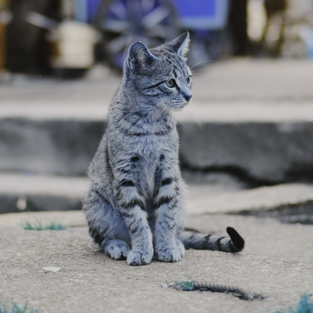
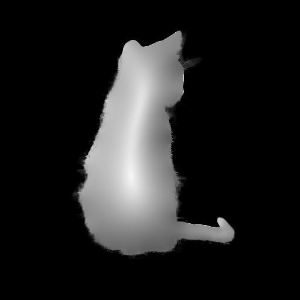
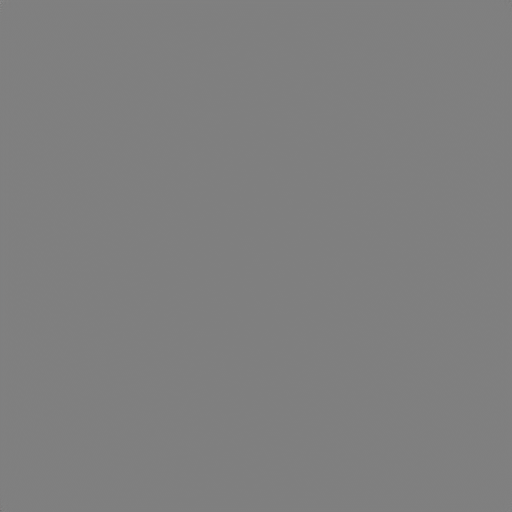

# D：データ・マップ画像

深度、チャンネル、FFT係数など、画面表示だけでなく別エフェクトの入力データとして扱う画像向けのエフェクトです。

## AOD_ChannelRemap

- **分類:** D：データ・マップ画像

RGBA各出力チャンネルを、入力チャンネル・定数・別レイヤーのチャンネルから再構成します。

### パラメーター

- `Layer Color Space`: 別レイヤーのチャンネル解釈に使う色空間です。
- 各`Output R/G/B/A`: 入力元をInput、Value、Layerから選択します。
- `Input Channel`、`Value`、`Layer`、`Layer Channel`: 各出力チャンネルの具体的なソースを指定します。

## AOD_DepthFog

- **分類:** D：データ・マップ画像

グレースケール深度マップを、PowerまたはBeer–Lambert則の霧Falloffへ変換します。

### パラメーター

- `Falloff`: Power／Beer–Lambertなどの減衰方式を選択します。
- `Near/Far Distance`: 32bpc深度値の近点・遠点を設定します。
- `Power Exponent`、`Beer-Lambert Density`: 各減衰式の形状を調整します。
- `Use Color Map`、`Near Color`、`Fog Color`: 距離値を2色間のフォグ色へ変換します。
- `Clamp Output`、`Use Original Alpha`: 出力範囲とアルファを制御します。

## AOD_IFFT

- **分類:** D：データ・マップ画像

実部レイヤーと虚部レイヤーから2次元逆フーリエ変換を行い、画像を再構成します。

### パラメーター

- `Real Input`、`Imaginary Input`: FFT実部・虚部を持つレイヤーを指定します。
- `Process Width/Height`: IFFT処理解像度を指定します。0では入力サイズを使用します。
- `Offset`、`Scale`: 入力係数の保存時変換を元へ戻す値です。
- `RGB Only`、`Raw Mode`: アルファ保持と32bpcの生係数入力を切り替えます。

### 補足

プレビューは入力未接続時のニュートラル表示です。実用時は同じ条件で書き出した`AOD_FFT`のReal／Imaginaryレイヤーを接続し、32bpc Raw Modeを推奨します。

## AOD_SpaceConvert

- **分類:** D：データ・マップ画像

画像を極座標、曲線座標、円盤写像、Radon、直線Houghなどの表現へ変換し、対応モードでは逆変換します。

### パラメーター

- `Space`、`Direction`: Polar、Log-Polar、Spiral Polar、Square-Disc、Elliptic、Parabolic、Bipolar、Radon、Line HoughとForward／Inverseを選択します。
- `Center`、`Custom Center`、`Radius`、`Custom Radius`、`Angle Offset`: Polar／Log-Polar系の座標範囲を設定します。
- `Spiral Turns`、`Focus / Radius`、`Coordinate Extent`: Spiral、Elliptic、Bipolar固有の座標形状を設定します。
- `Angle Samples`、`Detector Samples`、`Samples per Ray`: 積分変換の内部解析解像度を指定します。
- `Edge Threshold`、`Weighted Votes`: Hough変換のエッジ投票条件を設定します。
- `Line Hough Channels`: 従来のLuminance、RGBA独立処理、R／G／B／A単独表示・逆変換を選択します。
- `Ram-Lak Radius`: Radon逆変換のフィルター付き逆投影カーネルを設定します。
- `Interpolation`、`Edge`、`Output Gain/Bias`、`Clamp Output`: 再サンプリングとデータ出力を制御します。
- `Post Transform`: 変換後空間へ`Anchor Point`、`Position`、統合／分離`Scale`、`Rotation`、`Skew`、`Skew Axis`を適用します。変換済み画像をtileするのではなく、逆Transformした座標で各空間式を直接評価するため、対応する空間では表示範囲外も連続して描画できます。

### 補足

RadonのInverseは離散フィルター付き逆投影、HoughのInverseは検出線の可視化を目的とした逆投影です。後者は厳密な元画像復元ではありません。
