# P：一般写真・連続階調画像

写真、滑らかなグラデーション、細部を含むイラストなど、連続階調を持つ素材で効果を確認しやすいエフェクトです。

## AOD_ColorAjust

- **分類:** P：一般写真・連続階調画像

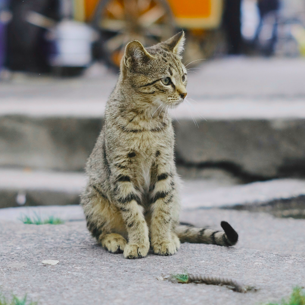

OKLCH、OKLAB、LAB、HSLなどの色空間で、色相・彩度感・明るさを調整します。

### パラメーター

- `Color Space`: 調整に使用する色空間を選択します。
- `Hue Shift`、`Chroma Scale`、`Lightness Delta`: 色相の回転、彩度成分の倍率、明度差を設定します。
- `Clamp to sRGB`: 出力をsRGB範囲へ制限します。
- `Fallback Preview`: 未対応の組み合わせを確認するためのフォールバック表示です。

## AOD_ColorComposite

- **分類:** P：一般写真・連続階調画像

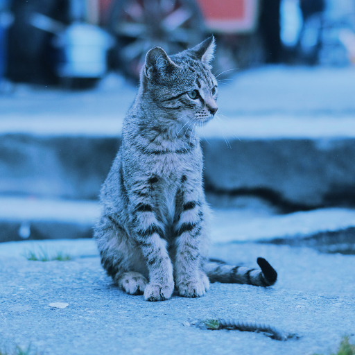

複数の色またはレイヤーを、指定した描画モードと不透明度で順番に合成します。

### パラメーター

- `Number of Composite Inputs`、`Add/Remove Composite`: 合成スロット数を管理します。
- 各`Composite`: 色／レイヤー入力、標準または高度な描画モード、不透明度を設定します。
- `Show Advanced Blend Modes`: 高度な描画モード群の表示を切り替えます。

## AOD_ColorConvert

- **分類:** P：一般写真・連続階調画像

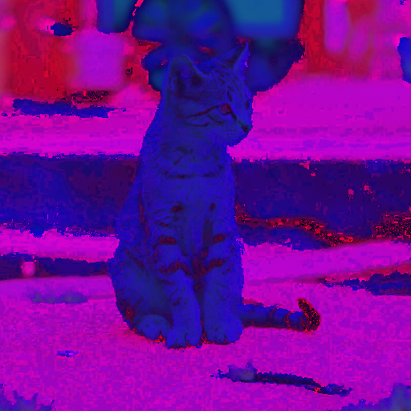

RGBとOKLAB、OKLCH、LAB、YIQ、YUV、HSL、HSV、CMYKなどの色空間を相互変換します。

### パラメーター

- `From Color Space`、`To Color Space`: 入力値と出力値の色空間を選択します。
- `Clamp Output 0..1`: 変換結果を0〜1へ制限します。
- `Fallback Preview`: 変換値を画面上で確認しやすくする補助表示です。

### 補足

色空間によっては出力チャンネルが表示用RGBではなくデータ値を表すため、見た目より数値利用を目的とする場合があります。

## AOD_ColorQuantize

- **分類:** P：一般写真・連続階調画像

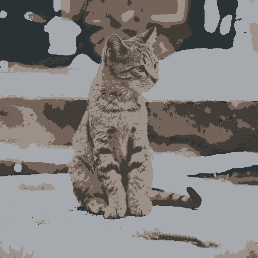

k-means／g-means系のクラスタリングで画像の色数を減らします。

### パラメーター

- `Cluster Method`、`Colors (K)`、`Auto Max Clusters`: クラスタリング方式と色数を指定します。
- `Max Iterations`、`Seed`、`Init Method`: 反復回数、乱数、初期化方式を設定します。
- `Color Space`: 色差の計算空間を選択します。
- `Area Similarity Threshold`、`g-means Alpha`、`Selected Colors`: 自動分割や指定色クラスタの条件を調整します。
- `RGB Only`、`Use GPU`: アルファ保持とGPU処理を切り替えます。

## AOD_DisplaceScatter

- **分類:** P：一般写真・連続階調画像（補助入力: D）

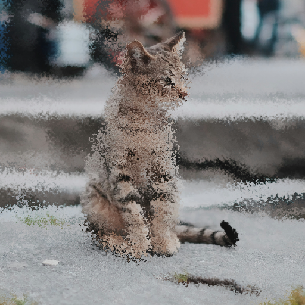

手続き的なベクトル場と任意マップを使い、画像を連続的に変位・散乱させます。

### パラメーター

- `Scatter Amount`、`Complexity`、`Scatter Algorithm`: 変位量、ノイズ複雑度、散乱方式を設定します。
- `Sampling Distribution`、`Distribution Shape`、`Grain Size`: サンプリング分布と粒度を調整します。
- `Noise Offset`、`Noise W`、`Seed`: ノイズ場の位置、時間軸相当の値、乱数を設定します。
- `Scatter/Grain/Noise Offset Map`: 量・粒度・ノイズ位置をレイヤーまたは入力画像から制御します。
- `Direction`、`Anisotropy`とそのマップ: 散乱方向と異方性を指定します。
- `Texture`: テクスチャ入力、チャンネル、影響度を設定します。
- `Edge Mode`、`Blend Opacity`、`Preserve Alpha`、`Clamp`: 境界処理と最終合成を制御します。

## AOD_FFT

- **分類:** P：一般写真・連続階調画像

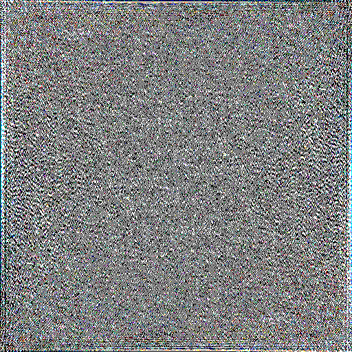

画像に2次元高速フーリエ変換を適用し、実部または虚部のスペクトルを出力します。

### パラメーター

- `Output`: 実部／虚部を選択します。
- `Process Width/Height`: FFT処理解像度を指定します。0では入力サイズを使用します。
- `Offset`、`Scale`: 係数を表示・保存するためのオフセットと倍率です。
- `RGB Only`、`Raw Mode`: アルファ保持と32bpcの生係数出力を切り替えます。

### 補足

正確なIFFT再構成には32bpcのRaw Modeが適しています。

## AOD_FourierFilter

- **分類:** P：一般写真・連続階調画像（補助入力: D）

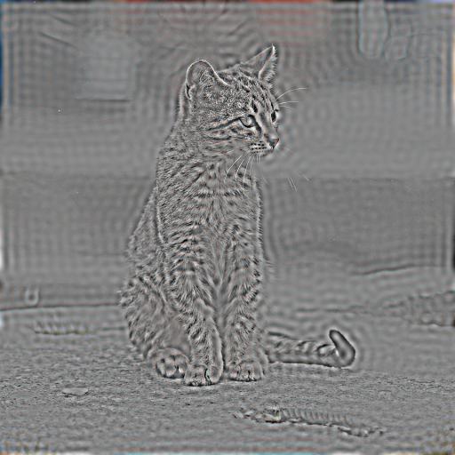

周波数領域のフィルターとマスクを使って、輪郭・低周波・方向成分などを整形します。

### パラメーター

- `Color Space`、`Process Width/Height`、`Target Channels`: 処理空間、解像度、対象チャンネルを指定します。
- `Filter Type`と`Param A–D`: フィルター方式と主要係数を設定します。
- `Param A–D X/Y`: X・Y方向を分離した係数を設定します。
- `Mask Layer/Channel/Strength`、`Invert/Swap Quadrants`: スペクトルマスクの入力と扱いを制御します。
- `Mix`、`Output Gain`、`Use GPU`、`Clamp`: 原画像との混合、出力倍率、GPU、範囲制限を設定します。

## AOD_GradientBlur

- **分類:** P：一般写真・連続階調画像（補助入力: D）

画像または別マップの輝度・RGB・色相彩度の勾配方向に沿って方向性ブラーを適用します。

### パラメーター

- `Vector Mode`、`Gradient Source`: ベクトルの解釈方法と勾配元を選択します。
- `Map Layer`: 別レイヤーを方向マップとして使用します。
- `Blur Radius`、`Samples`、`Strength`: ブラー距離、品質、影響度を設定します。
- `Edge Mode`、`Preserve Alpha`: 境界処理とアルファ保持を制御します。

## AOD_GradientDisplace

- **分類:** P：一般写真・連続階調画像（補助入力: D）

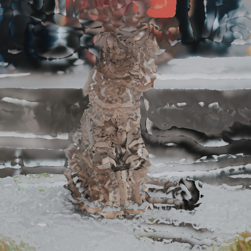

画像またはマップから得た勾配ベクトルに沿ってピクセルを変位させます。

### パラメーター

- `Vector Mode`、`Gradient Source`、`Map Layer`: 変位ベクトルの方式と入力を選択します。
- `Distance`、`Strength`: 移動距離と効果量を設定します。
- `Edge Mode`、`Preserve Alpha`: 画像外の扱いとアルファ保持を制御します。

## AOD_ImageCalculate

- **分類:** P：一般写真・連続階調画像

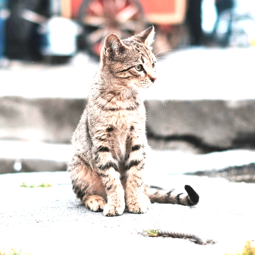

1枚または複数レイヤーに、Blender Math風の算術・比較・三角関数処理を適用します。

### パラメーター

- `Operation`: 加減乗除、指数、比較、丸め、三角関数などの演算を選択します。
- `Input B/C`、`Layer B/C`、`Value B/C`: 第2・第3引数を数値またはレイヤーから指定します。
- `Epsilon`: 除算や比較で使用する微小値です。
- `Channel`、`Calculation Color Space`: 対象チャンネルと演算空間を選択します。
- `Clamp Result`、`Use Original Alpha`: 出力範囲とアルファを制御します。

## AOD_ImageScaler

- **分類:** P：一般写真・連続階調画像

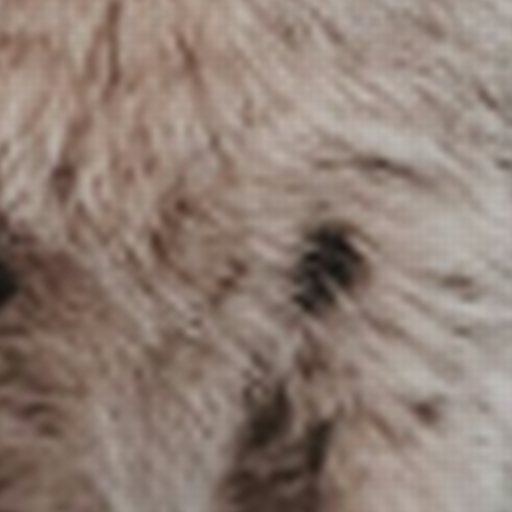

補間方式・アンカー・画像外処理を指定して、画像を高品質に拡大・縮小します。

### パラメーター

- `Scale Mode`、`Use Reciprocal`、`Scale`: パーセント、指数、2の累乗などの倍率指定を切り替えます。
- `Separate X/Y Scale`: X・Yを個別に拡縮します。
- `Anchor XY`、`Outside Pixels`: 拡縮中心と画像外ピクセルの扱いを指定します。
- `Interpolation`: 最近傍、バイリニア、バイキュービック、Lanczosなどを選択します。
- `Mitchell B/C`、`Lanczos Lobes`、`EQA Radius`: 選択した補間カーネルを調整します。

## AOD_MobiusTransform

- **分類:** P：一般写真・連続階調画像

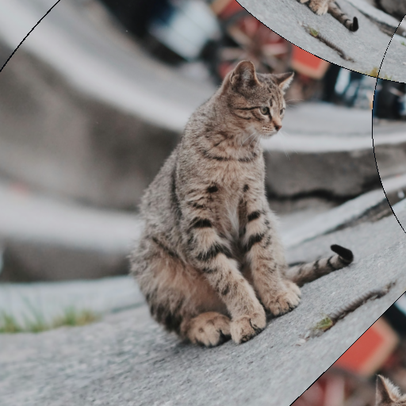

複素係数によるメビウス変換で、画像を円弧状・反転状にワープします。

### パラメーター

- `a.re/im`、`b.re/im`、`c.re/im`、`d.re/im`: 変換式 `(az+b)/(cz+d)` の複素係数です。
- `Use Layer Center`、`Center`、`Scale`: 座標系の中心とスケールを設定します。
- `Edge`、`Interpolation`、`Anti-alias`、`Mipmap Bias`: 境界、補間、品質を調整します。

## AOD_ScatterMap

- **分類:** P：一般写真・連続階調画像（補助入力: D）

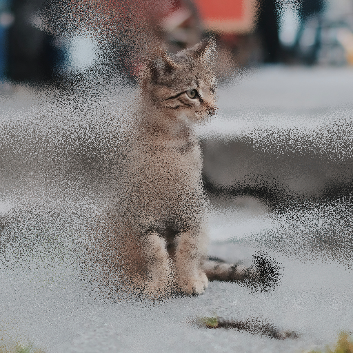

マップ制御のGather／Swap方式で、ピクセルまたは粒単位の散乱を適用します。

### パラメーター

- `Scatter Mode`、`Amount`、`Radius`、`Grain Size`、`Gather Samples`: 散乱方式と基本量を設定します。
- `Direction`、`Anisotropy`: 散乱分布を方向性のある楕円へ変形します。
- `Grain Kernel`: 形状、サイズ／位置／形状ランダム、密度、カスタムテクスチャを設定します。
- `Fill`、`Fill Opacity`: 粒内部を元テクスチャ、平均、中央値、中心色で塗る方法を選択します。
- `Amount/Radius/Grain Size/Anisotropy Map`: 各値を入力画像または別レイヤーから制御します。
- `Seed`、`Temporal Mode`、`Edge Mode`: 再現性、フレーム変化、境界処理を指定します。
- `Blend Opacity`、`Preserve Original Alpha`、`Clamp`: 原画像との合成と出力を制御します。

## AOD_SingularValueDecompose

- **分類:** P：一般写真・連続階調画像

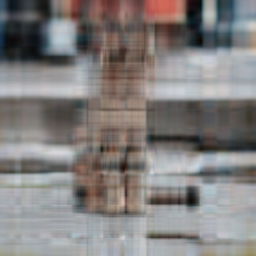

画像を2次元特異値分解し、指定ランクのLow-rank近似として再構成します。

### パラメーター

- `Low Rank (k)`: 再構成に残す特異値の数を設定します。
- `Process Width/Height`: 処理解像度を指定します。0では入力サイズを使用します。
- `RGB Only`: アルファを元画像から保持します。

### 補足

低いkほど大きな構造だけが残り、圧縮・抽象化された見た目になります。
