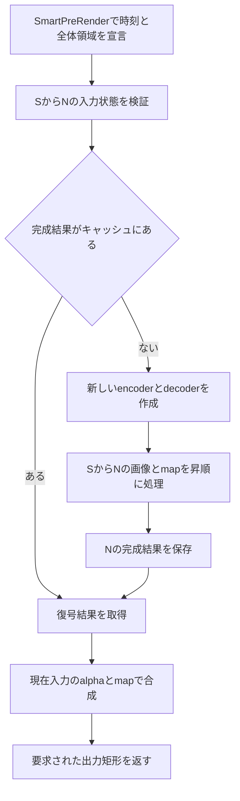

# AOD_CodecMap 設計と初版実装

作成日: 2026-10-11。名称はユーザー確認済み。以下は設計方針と将来の拡張候補を含む。初版の実際のUI・制約は[プラグインREADME](../../plugins/codec-map/README.md)、実施済みの検証は[検証記録](../../plugins/codec-map/tests/VALIDATION.md)を参照。

## v0.1の実装範囲と設計からの変更

- `cargo generate`で`plugins/codec-map`を生成し、H.264、Independent、Past Only、ROI、SmartFX、Compute Cacheを実装した。VP9と未来参照は未実装で、機能しない選択肢はUIに出さない。
- x264の直接リンクではなく、固定したFFmpeg 8.1.2のDLLを同梱し、公開libavcodec APIからlibx264を呼び出す。1個の16×16ブロックごとに`AVRegionOfInterest`を渡す。DLLをAE内で読み込み、CLI・一時動画は使用しない。依存関係は[native/README](../../plugins/codec-map/native/README.md)に記載。
- マップの配置はStretchのみ。`Map Source = Uniform / Layer`を明示的に選ぶ。Layer未選択は黒マップ。位置・エフェクトを焼き込む場合はプリコンポーズする。
- GOP基準時刻は入力レイヤーのソース時刻0。CRF、GOP長、Temporal Modeは時間変化不可。各時刻のマップ・チャンネル・gamma・offsetは個別に取得する。
- キャッシュキーには全入力YUV、全offset、時刻列、寸法、フレームレート、CRF、世代、実装schemaを含める。RGB/alpha・合成設定は毎回現在の入力へ適用するため、復号キャッシュには含めない。入力状態の前後比較には`PF_GetCurrentState`と`PF_AreStatesIdentical`を使う。
- Windows x64用の取得・検証・パッケージスクリプトを用意。macOSはFFmpeg・x264をソースからビルドし、ソース・ライセンスを添付するUniversalパッケージ用スクリプトと専用CIを追加。macOS版AEでの実機動作は未検証。

以下に記すFit/Fill、任意のGOP起点、追加コーデックなどは拡張案であり、v0.1の機能一覧ではない。

マップで領域ごとの量子化強度を指定し、実際の動画コーデックで圧縮・復号した画像を返す After Effects エフェクトを作る。既定は過去参照あり・未来参照なしとし、フレームの要求順、MFR、キャッシュの有無で結果が変わらない構成にする。

技術検証の第一候補は **H.264 / x264 の CRF + AQ + QP offset**。VP9 / libvpx もバックエンド候補とするが、現行実装のキーフレームへのROI適用制約を解決・検証してから正式対応とする。コーデックの採用条件は下記に分離する。

## 名称と提供範囲

名称は **AOD_CodecMap** に確定する。複数のコーデックによる圧縮・量子化をマップで制御する機能を表す。

実装時のディレクトリは `plugins/codec-map/`、crate は `codec_map`、Match Name は `CodecMap`、Category は `Aodaruma`。公開後は Match Name とパラメーターIDを保持する。

対象はAEの映像エフェクト。実際の圧縮を利用するが、出力はRGBA画像であり、動画ファイルの書き出し、音声、領域別の厳密なビット予算は初版の範囲に含めない。H.265、AV1、ハードウェアエンコーダーは後続候補とする。

## 参照調査からの修正点

[ROI対応コーデック調査](https://chatgpt.com/c/6aca603f-c598-83ec-87f4-029f566a1ffe) の時間依存の整理とGOPからの再計算方針を採用する。ただし、以下は実装ソースに合わせて修正する。

| 項目 | 確認できた条件と設計への反映 |
| --- | --- |
| x264の固定QPとROI | `quant_offsets` にはAQが必要だが、CQPの初期化はAQを無効にする。初版はCRFと有効なAQを組み合わせ、固定QPと任意ROIの両立を約束しない。AQ強度0も無効化につながる。 |
| VP9のROI | 8×8、最大8セグメントのAPIがある。一方、確認した実装はREALTIMEかつspeed 5以上に制限され、呼び出し側でintra-onlyフレームを除外する。毎フレームをKFにするだけではROIモードにならない。 |
| GOP結果のキャッシュ | 17を要求された際に12〜23を先行計算すると、18以降も取得する。未来OFFでは12〜17だけを扱う。 |
| 復号画像のチェックポイント | 画像を保存しても、エンコーダーの予測・レート制御・エントロピー状態は復元できない。GOP先頭からの再実行と、完成結果の再利用を区別する。 |

x264の根拠: [QP offsetのAPI](https://github.com/mirror/x264/blob/c24e06c2e184345ceb33eb20a15d1024d9fd3497/x264.h#L808)、[パラメーター検証](https://github.com/mirror/x264/blob/c24e06c2e184345ceb33eb20a15d1024d9fd3497/encoder/encoder.c#L951)。VP9の根拠: [ROI適用条件](https://github.com/webmproject/libvpx/blob/ed2a5b572f0f62a72d2e483dd3031841f08fb343/vp9/encoder/vp9_encoder.c#L579)、[intra-onlyの除外](https://github.com/webmproject/libvpx/blob/ed2a5b572f0f62a72d2e483dd3031841f08fb343/vp9/encoder/vp9_encoder.c#L4273)。ヘッダーやラッパーが受付に成功することだけではROIの有効性を判定しない。

## マップの意味

### 量子化の指定

`Map Layer` は画像の品質を下げる位置を指定する。既定では白を強い圧縮、黒を弱い圧縮とする。マップなしは全面白として扱う。

1. 入力画像と同じ時刻のマップを取得する。過去を再計算するときも各時刻のマップを使用する。
2. マップを入力レイヤーの全体座標に合わせる。初版は全体へのStretchを既定とし、レイヤーのoriginと実際に返されたworldの範囲を反映する。コンポジション空間での自動位置合わせは行わない。
3. Luma / R / G / B / Alphaからチャンネルを選ぶ。Lumaは `0.2126 R + 0.7152 G + 0.0722 B`。マップ値はデータとして扱い、独自のガンマ変換を追加しない。
4. RGBチャンネルは必要に応じてunpremultiplyしてから評価する。InvertとGammaを適用し、RGB系は最後にマップのalphaを掛ける。Alpha選択時はalphaを二重に掛けない。完全透明画素・マップ範囲外はInvertにかかわらず0、非有限値も0とする。
5. 画素マップ `m(x,y)` を0〜1に制限し、コーデックのROIブロック内で面積平均する。端の不完全ブロックは実画像部分だけで平均する。

```text
m_block = mean(m over valid pixels in the block)
delta = BlackOffset + (WhiteOffset - BlackOffset) * m_block
```

正のoffsetは強い量子化、負は弱い量子化。x264は16×16ごとのfloat offset、VP9は8×8ごとの値を8段階へ丸めてセグメントIDに変換する。VP9は `id = round(7 * m_block)` とし、セグメントjのdeltaを両端値から線形補間して整数化する。8段階を画素ごとの連続QPとは表示しない。

このdeltaはエンコーダーの判断への加算指示であり、最終QPや局所ビットレートを固定するものではない。コーデック間で同じ数値の見た目は一致しない。プレビューも「指定offset」と「実測値」を区別する。[x264 API](https://github.com/mirror/x264/blob/c24e06c2e184345ceb33eb20a15d1024d9fd3497/x264.h#L808)、[libvpx ROI API](https://github.com/webmproject/libvpx/blob/ed2a5b572f0f62a72d2e483dd3031841f08fb343/vpx/vp8cx.h)

### 黒い領域を元画像のまま保つ

量子化を弱くしても、色差の間引き、予測、ブロック境界のフィルターで画素が変化する。そこで出力方法を二つ用意する。

| Output Mode | 動作 |
| --- | --- |
| **Map Isolated** 既定 | ROIを指定して実際に圧縮した後、同じ画素マップで元画像へ合成。黒は元画像をそのまま返す。 |
| Codec Result | ROIを指定した復号画像を全体に出す。領域外への圧縮の影響も見える。 |

元のpremultiplied RGBを `C`、復号後に元alphaを掛けたRGBを `D`、Mixを `p` とする。Map Isolatedでは `w = p*m`、Codec Resultでは `w = p` とし、`C_out = (1-w)*C + w*D`。alphaは現在時刻の入力値を保持する。`w=0` は演算・量子化を通さず元の画素値をコピーする。

これは局所劣化を見せるための合成であり、出力全体が単一ストリームの復号画像と一致するのはCodec Resultの場合だけ。後段合成した画像をコーデックの参照画像へ戻さない。両モードとも内部のROI制御を実行し、単純な「全体圧縮後のマスク合成」だけで代替しない。

## 時間方向の設計

### モードと既定値

| モード | 画像を取得する範囲 | 扱い |
| --- | --- | --- |
| **Past Only** | 固定GOPの先頭S〜要求N | 初版の既定。未来OFF。 |
| Independent | 要求Nのみ | 各要求で新しいencoder/decoderを作る。All-Intraだけで内部状態の独立性を仮定しない。 |
| Bidirectional GOP | 固定GOPの先頭S〜末尾E | 後続版。Allow Futureを明示的にONにした場合だけ。 |

初版は過去参照を含めて完成させる。Independentだけの試作は中間工程とする。未来モードの実装前は動作しないチェックボックスを表示せず、未来参照はOFF固定とする。後続版でも既存プロジェクトの既定値はOFFを維持する。

### 固定GOPと再現性

基準時刻 `t0` とフレーム間隔 `dt` はAEの有理数時間で保持する。`t0` はレイヤーの有効開始時刻を基準とし、タイムラインをスクラブした位置やワークエリア先頭で変えない。初期GOP長は12フレーム、設定範囲は1〜60。

```text
n = floor((t - t0) / dt)
phase = t - (t0 + n*dt)
s = floor(n / G) * G
sample(k) = t0 + k*dt + phase
```

サブフレーム要求ではphaseを保って過去を取得し、同じphaseのGOPを再生する。丸めた整数フレームと混同しない。時刻、phase、time scale、フレーム間隔をキーに含める。開始前・終了後の出力はホストが返す現在入力をそのまま返し、存在しない過去や未来を取得しない。整数計算は負数に対するfloorとオーバーフローを検証する。

Past OnlyでG=12、N=17ならS=12であり、12〜17を昇順にencode/decodeする。各GOP先頭でencoderとdecoderを新規生成し、H.264はIDR、VP9はKFを強制する。単なるI-frame挿入ではレート制御などの状態を切り離せないため、前のGOPのcontextを流用しない。

自動シーンカット、open GOP、intra refresh、フレームdrop、2-pass解析は初版では無効。GOP境界では予測状態がリセットされるため、見た目に周期的な変化が出る可能性がある。GOP長はその見た目と再計算量の両方を変える設定とする。

未来OFFの保証は、このプラグインが `sample(k) > t` の画像・マップ・値を要求しないこと。入力の上流に既にある時間エフェクトの依存性まで除去する保証ではない。

### 未来モードの拡張

Bidirectional GOPはGOP内に依存を閉じ、`E = min(S+G-1, 有効な最終サンプル)` まで取得する。H.264のB-frameとlookaheadをGOP内に制限し、末尾でflushする。Nごとに終端を変えず、同じGOPでは同じ完全な入力列を使う。PTSで要求画像を取り出し、packet順やDTSで対応付けない。

未来モード専用の完成GOPキャッシュを使い、Past Onlyの結果とはキー・クラスを分ける。libvpxのREALTIME ROI経路にlookaheadを追加できるとは仮定せず、対応を実証できたバックエンドだけで提供する。

## コーデックバックエンド

### H.264

初版はFFmpegのlibx264エンコーダーとH.264デコーダーを使用する。公開APIのROIをブロックごとに渡す。将来、マップ入力のオーバーヘッドが問題になった場合はx264直接APIへの置き換えを検討する。CLIをフレームごとに起動せず、一時動画ファイルも生成しない。

| 項目 | 初版の設定案 |
| --- | --- |
| 品質制御 | CRF 28、AQ mode 1、AQ strength 1。CRFは1〜51。 |
| 未来OFF | `bframes=0`, `rc-lookahead=0`, `sync-lookahead=0`, `mbtree=0`。 |
| 時間予測 | IDRからP-frame、参照枚数は初版1。 |
| 境界 | closed GOP、scenecut無効、intra refresh無効。 |
| マップ | 16×16単位の `quant_offsets`、black=0、white=+12。 |
| 並列 | encoder/decoder内のthread数は初版1、AEのMFR側で並列化。 |

`zerolatency` は参考にするが、preset適用後の最終設定を読み戻して検証する。設定だけで低遅延を断定せず、Nより後を入力せずにNの出力が得られることを試験する。[x264 zerolatency実装](https://github.com/mirror/x264/blob/c24e06c2e184345ceb33eb20a15d1024d9fd3497/common/base.c#L675)

AQの自動補正も加わるのでUIを「Base QP」とせず「Base Quality / CRF」とする。量子化指示の端値はバックエンドで検証し、飽和をプレビューで識別可能にする。

### VP9

encoder/decoderともlibvpxの直接APIを使う。試作は `VPX_RC_ONE_PASS`, `VPX_Q`, `g_lag_in_frames=0`, `VPX_DL_REALTIME`, `cpu-used=5`, `aq-mode=0`, `auto-alt-ref=0`, `rc_dropframe_thresh=0` を起点にする。ROIには `VP9E_SET_ROI_MAP` を使い、skip=0、delta_lf=0、ref_frame=-1とする。delta_qはAPIの−63〜63に制限する。[libvpx設定API](https://github.com/webmproject/libvpx/blob/ed2a5b572f0f62a72d2e483dd3031841f08fb343/vpx/vpx_encoder.h)、[FFmpeg側のROI条件](https://github.com/FFmpeg/FFmpeg/blob/master/libavcodec/libvpxenc.c)

正式対応の必須条件は、GOP先頭とIndependentでもマップが実際の符号化へ反映されること。現状はその条件を満たすとは扱わない。未改変版で確認し、必要ならlibvpxのROI経路の修正を別の変更として検証する。条件分岐を一つ外すだけで解決したとは判断せず、KFの分割・量子化経路まで調べる。

同じ画像をKFとPとして二度入力する回避策は、時間モデルと見た目を変えるため標準仕様には採用しない。未対応時にマップを黙って無視したり、H.264へ自動切り替えしたりしない。試作版では制約を明示し、正式UIには合格した組み合わせだけを表示する。

### 依存と配布

x264はGPL版と商用ライセンスの選択肢があり、libvpxはBSD系のライセンスとPATENTS文書を持つ。FFmpegは有効化する構成でライセンス条件が変わる。既存workspaceのMPL表記だけで追加バイナリの条件を満たしたことにはしない。[VideoLAN](https://images.videolan.org/developers/x264.html)、[libvpx LICENSE](https://github.com/webmproject/libvpx/blob/ed2a5b572f0f62a72d2e483dd3031841f08fb343/LICENSE)、[FFmpeg](https://ffmpeg.org/legal.html)

技術試作と配布構成の決定を分ける。公開前に採用バージョン・リンク構成・必要なライセンス文書・対応ソースの提供範囲を既存の [LICENSING.md](../../LICENSING.md) と合わせて確定する。DLL分離だけで条件が消えるとは扱わない。Windows/macOSとも依存ソースとビルド設定を固定し、他のAdobeプラグインとのシンボル・DLL名の衝突を避ける。

## AEとキャッシュ

### reaction-diffusion-rsから引き継ぐもの

参照したローカルcheckoutは `reaction-diffusion-rs` の `8b107de652598a8f22003d1e4da74f753eadfa7d`。関連実装は `crates/aeplugin/src/lib.rs` と `compute_cache.rs`、設計説明は `docs/aeplugin/aftereffects_compute_cache_spec.md`。

| 参照箇所 | 今回の適用 |
| --- | --- |
| `COMPUTE_CALLBACKS`、`register_compute_cache` / `unregister_compute_cache` | GlobalSetup/Setdownでクラスを管理する。 |
| `ReceiptGuard` | 成功、エラー、キャンセルのいずれでもcheckinし、suiteを後から解放する。 |
| `SimOptions`、`generate_key_cb` | schema、設定、解像度、時刻、入力状態を明示したキーにする。 |
| `ResetCounter`、`cache_schema` | Resetは新しいキーへの切り替え。schema変更で旧結果を再利用しない。 |
| `computed_until`、`checkpoints` | 過去へ戻れる必要性を引き継ぐ。GPU状態の保存・復元はcodecへそのまま移植しない。 |
| 各時刻のmapとパラメーターをサンプルする再計算ループ | 過去のマップ・offset・Gammaも該当時刻で評価する。 |

RD実装のSequentialキーの省略や、過去のmap取得に失敗したとき現在mapへ代替する処理は採用しない。CodecMapは出力順序に依存しない正確性を優先し、取得失敗はエラーにする。キャッシュへのraw pointerをreceiptの寿命外へ保持しない。

現workspaceは `after-effects` を `0e0b197850f28c1bb24e8c82fce2e3d4c120d1e9` に固定しており、参照チャットの最新版に関する記述とは区別する。このrevのツリーには専用Compute Cacheラッパーが見当たらないため、実装開始時にbindingsとSDKヘッダーを確認し、必要ならRDと同様の小さなFFIアダプターを追加する。共有依存の更新を前提にしない。ABIの構造体・関数型・Windows/macOSのサイズを検証する。

### 初版のキャッシュ単位

初版は**要求Nの完成した復号結果**を不変値としてCompute Cacheへ保存する。キーはGOP先頭だけでなくS〜Nの依存範囲を含む。必要に応じて、各時刻の色変換済み画像とROI配列も別クラスで共有する。



17の結果があっても、18の符号化状態があるとは扱わない。18が未計算なら12から再実行する。これにより順不同・逆再生・並列・purge後でも同じ手順になる。初版のcold renderは最大G枚、GOP全体を初回順次取得する際は最大 `G*(G+1)/2` 枚を符号化する。G=12では78枚であり、このコストは性能試験で測る。

同一キーの重複要求はCompute Cacheに集約する。異なるNの同時計算は独立sessionを使う。computeから別の出力frameキーを再帰的に計算させず、隣のMFRタスクを待たない。codec contextをグローバルMutexで一つだけ共有しない。

後続最適化では、同じ有効入力列の末尾に限って継続できる一時sessionを検討できる。ただし逆向き要求やprefix変更では破棄して再計算し、完成frameを不変キーで保持する。これは必須の正しさから切り離し、キャッシュが空でも動く基準実装と常に比較する。

### キャッシュキーと失効

| キー要素 | 内容 |
| --- | --- |
| 実装 | cache schema、backend、固定したcodec build ID、CPU経路・thread設定など出力に影響する設定。 |
| 時間 | mode、t0、dt、phase、S、N、未来モードならE、有効入力範囲。 |
| 画像仕様 | 全画像寸法、origin、downsample、pixel aspect、入力bit depth、内部pixel format、色変換・padding規則。 |
| 設定 | GOP、CRF等の固定設定、各時刻のmap選択・チャンネル・反転・Gamma・offset。 |
| 入力 | 元画像とmapのS〜Nに対するホストの状態、必要なパラメーター状態。 |
| リセット | エフェクトinstance識別とReset世代。pointer値だけを永続的な識別に使わない。 |

ホストの `PF_GetCurrentState` に実際の依存範囲を渡し、キャッシュを使う前に状態を取得し直す。各サンプルを含む時間範囲の境界はSDKに合わせて実装・試験する。`None, None` の全時間ハッシュだけに頼らない。保存状態との比較には `PF_AreStatesIdentical` を使い、stateからキーへの変換はSDKが保証する表現に限定する。[Parameter Supervision](https://ae-plugins.docsforadobe.dev/effect-details/parameter-supervision/)

S〜Nの元画像、map、offsetの編集はNを失効させる。Mixや出力モードは復号後の合成なので、codecキャッシュから分離する。将来のキーフレーム編集で現在までの補間値も変わる場合は失効が必要。ホストが保守的に失効させる場合があっても、未来OFFの画素出力が未来の実画像に依存しないことを保証する。

### SmartFXとMFR

`SmartPreRender` はRenderPlanを作り、キャッシュのhit/missにかかわらず必要な各時刻の元画像とmapを固有checkout IDで宣言する。予測・フィルターがフレーム全体を参照するため、AEの出力ROIだけを圧縮しない。入力は全体を取得し、最後に出力要求範囲を切り出す。AEの描画ROIとcodecの品質ROIを別の概念として扱う。

`SmartRender` は宣言済みのworldを順に取得し、codecが必要とする所有バッファへ変換する。キャッシュcallbackへ渡す借用がAPI呼び出しの終了を超えないようにし、checkout中のworldやhost callbackを後から使うworkerへ保存しない。長期保存する値は所有データのみ。callbackで重い処理を始める前にキー入力を揃える。入力を遅延供給する場合は呼び出しthreadとhost callbackの有効範囲をSDKで検証し、保証できない場合は所有するYUV入力列を先に準備してメモリ予算へ計上する。

PiPLとGlobalSetupの両方にSmartRender、DeepColor、FloatColor、WideTimeInput、AutomaticWideTimeInputを設定する。時間によって静止入力の結果も変わり得るためNonParamVaryを検討・検証し、PixelsIndependentは設定しない。MFR対応フラグは順不同・並列・キャンセル試験を通して有効にする。[PF_OutData](https://ae-plugins.docsforadobe.dev/effect-basics/PF_OutData/)

cache receiptとlayer checkoutはRAIIで解放する。キャッシュ値は完成後に変更せず、失敗・中断結果を公開しない。各フレーム処理間でabortを確認する。選択済みmapの正当な空画像は透明なmapとして扱い、APIの取得エラーとは区別する。Suite非対応時は同じRenderPlanをキャッシュなしで実行し、結果を変えない。初版の実機対象はAE 2025以降、Windows x64から開始し、macOSも配布対象として同じ検証を行う。Premiereの時間モードは別途確認するまで対応を標榜しない。

### メモリ

Compute Cacheはpurge・プロジェクト再読込で失われる前提とし、`approx_size_value` は所有plane、map、補助データを含める。初版は永続ディスクキャッシュを設けない。[Compute Cache API](https://ae-plugins.docsforadobe.dev/effect-details/compute-cache-api/)

3840×2160のRGBA f32は約126.6 MiB、8-bit YUV420はpaddingを除き約11.9 MiB。12枚のRGBA f32だけで約1.48 GiBになるため、全GOPのRGBAを常時保存しない。復号キャッシュは必要なYUV planeを主体にし、alphaと合成元は現在入力から取得する。入力の変換バッファも可能な限り1枚ずつ消費する。

初期の作業メモリ予算は1要求256 MiBを目標とし、codec内部バッファと同時MFR要求は別途計測する。超過時は任意キャッシュを省き、品質・GOPを勝手に変更しない。最小の作業領域も確保できない場合は寸法と必要量を伴うエラーにする。

## 色と画素形式

初版はホスト側8/16/32 bpc、codec内部は8-bit YUV420を基準とする。16 bpcの正規化にはAEの最大値を使用する。codecへの入力はstraight RGBにし、透明部分のRGBは0に統一する。復号後に元alphaを掛けてホスト形式へ戻す。

初版の変換は入力のworking RGB数値へBT.709の係数・limited rangeを適用し、復号側も同じ条件で逆変換する。ICCや伝達関数の自動判定は行わない。リニアコンポではその数値を量子化する見た目になる。32 bpc対応はHDR保持を意味せず、codecに渡すRGBは0〜1へclampする。Map Isolatedの重み0の部分は元のHDR値も維持する。10-bit、4:4:4、明示的なtransfer変換は後続版とする。

奇数寸法は420に必要な偶数境界へedge paddingし、ROIグリッドもceilで確保する。復号後は元の範囲へcropする。rowbytes、負のstrideの扱い、origin、downsampleを固定し、AEの要求矩形が変わってもブロック原点を変えない。

## パラメーター案

| グループ | パラメーター | 初期値と仕様 |
| --- | --- | --- |
| Codec | Codec | 技術試作はH.264。正式版は採用条件を通過したものだけ。 |
| Codec | Base Quality | H.264 CRF 28。VP9採用時は別の尺度で表示。 |
| Temporal | Temporal Mode | Past Only / Independent。 |
| Temporal | GOP Length | 12、1〜60。Independentでは無効。 |
| Map | Map Layer | Noneで全面白。 |
| Map | Channel | Luma、R/G/B/Alphaも選択可能。 |
| Map | Invert / Gamma | OFF / 1.0。Gammaは0.1〜10、`m^(1/Gamma)`。 |
| Map | Black / White Offset | 0 / +12。H.264のUIは−24〜+24から開始。 |
| Output | Output Mode | Map Isolated / Codec Result。 |
| Output | Mix | 100%、0〜100%。 |
| View | Preview | Result / Map / Requested Offset / Difference。 |
| Cache | Reset Cache | 非アニメーションの世代番号を更新。出力の意味は変えない。 |

Codec、Base Quality、Temporal Mode、GOP Length、内部pixel formatは初版では非アニメーション。Mapのチャンネル・反転・Gamma・offsetは各時刻で評価し、MixとPreviewは現在時刻だけで評価する。UIの非表示・disableは既存の [動的UIルール](../development.md#動的-ui) に従う。

Mapプレビューは元の連続値、Requested Offsetは実際にbackendへ渡すブロック・セグメント値を表示する。Differenceは現在入力と実際に出力する合成画像の差分とし、alpha表示も定義する。圧縮byte数を出す場合はframeまたはGOPの測定値と明記し、局所kbpsや最終書き出し容量とは呼ばない。

## 実装構成と順序

テンプレートから生成し、最初はプラグイン内に機能を閉じる。既存の画素・サンプリング処理は `crates/utils` を利用する。共有化は他の時間エフェクトで同じ契約が必要になってから行う。

```text
plugins/codec-map/
  src/lib.rs                 AE entry points and parameters
  src/render_plan.rs         Rational time and dependency planning
  src/map.rs                 Sampling and codec ROI conversion
  src/color.rs               RGBA and YUV conversion
  src/cache.rs               Keys, receipts, immutable frame values
  src/codec/mod.rs           Capabilities and session interface
  src/codec/h264.rs          x264 and decoder adapter
  src/codec/vp9.rs           libvpx adapter after capability verification
  native/                   Small ABI shims when required
  tests/                    Host-independent codec and replay tests
```

`CodecCapabilities` はROI粒度、KFへのROI、対応pixel format、未来依存条件を持つ。`RenderPlan` は依存時刻とcheckout ID、`FrameInputs` は所有入力、`CodecSession` は要求内だけで使うencoder/decoder、`DecodedFrame` は不変の復号画像とPTSを持つ。Rustのsafe側で寸法・配列長・設定を検証し、FFIを小さな範囲へ閉じ込める。

| 段階 | 成果と完了条件 |
| --- | --- |
| 0 コーデック実証 | AEなしでx264のCRF+AQ+ROIを確認。VP9のKF/Pの制約を再現し、配布候補を選ぶ。依存ABIとWindows/macOSのビルド方法を固定。 |
| 1 Independent | 真のcodec往復、map、色変換、alpha、プレビューを実装。単一フレームのROIが効くことを確認。 |
| 2 Past Only | 固定GOP、過去map、SmartFX、入力失効、Compute Cache、MFRを実装。**ここまでを初版の機能完了条件**とする。 |
| 3 VP9正式対応 | KFとIndependentのROIを含む受入試験に合格。必要な上流修正または固定patchを管理。 |
| 4 未来ON | 閉じたGOPの先読み、B-frame、PTS対応、未来依存追跡、完成GOPキャッシュを追加。 |
| 5 拡張 | session継続による高速化、4:4:4/10-bit、CBR/VBR、追加codecを個別に検証。 |

CBR/VBRは品質マップとビット予算の競合があるため初版から分ける。H.264の配布条件が採用方針と合わない場合は、VP9のROI修正の完了を初版の前提に変更する。未対応のマップ動作を完成扱いにしない。

## 受入試験

| 試験 | 合格条件 |
| --- | --- |
| codecのROI | 同じdetailを左右へ配置し、map反転で量子化指示・復号誤差分布が対応して変わる。KFとPを別々に確認し、flat画像だけで判定しない。 |
| 過去依存 | 12〜17の途中画像/mapを変えると17に反映。現在mapを過去へ使い回さない。 |
| 未来OFF | 17要求のcheckoutに18以降がない。S〜17を同一にした異なる未来列で17の出力が一致する。上流は時間依存のないfixtureを使う。 |
| 要求順 | 順再生、逆再生、ランダム、重複、MFRで、同一binary・設定の出力hashが一致する。 |
| キャッシュ | cold/warm/purge/プロジェクト再読込/Resetで出力一致。元画像、map、curve、寸法、downsample変更で必要な結果が失効する。 |
| GOP | G=1/12/60、境界前後、途中開始、短いレイヤー、subframe、23.976/29.97fps、負の時間、time remapを確認する。 |
| 局所適用 | Map Isolatedでm=0の画素は完全一致、Mix=0は全画素一致、alphaは両モードで保持。Codec Resultは実際のdecode出力と一致する。 |
| 画素領域 | 全体・部分ROIの出力が同じ。奇数寸法、異なるmap寸法、透明端、8/16/32 bpc、strideとoriginを確認する。 |
| エラー | map取得失敗、非対応codec、cancel、allocation失敗で代替画像をキャッシュしない。receiptとnative objectが解放される。 |
| 性能 | 1080p/4K、G=12/60、cold/warm、MFR ON/OFFの時間・peak memory・処理枚数を記録。実測前にfps目標の達成を約束しない。 |
| 未来ON | 後続版でcheckout上限E、GOP末尾flush、PTS順、切り詰められた末尾、未来編集による失効を確認する。 |

codecの戻り値、実際に採用された設定、frame type、PTS、再計算範囲、cache hit/missを開発ログへ記録する。テストは固定したコーデックビルド内で再現性を判定し、異なるOS・SIMD実装間のbit一致は別途評価する。

## 実装開始時に確定する事項

- x264とdecoderを含む配布構成、またはVP9を先行させる場合のKF ROI修正方針。
- codec試作での実測品質に基づくCRF・offset・GOPの初期値。
- AE 2025と固定版Rust bindingsでの時間範囲・Compute Cache ABI・layer座標の動作。

上記の受入条件すべてを完了したことを意味しない。実際の通過状況と未確認範囲は[検証記録](../../plugins/codec-map/tests/VALIDATION.md)を参照。
