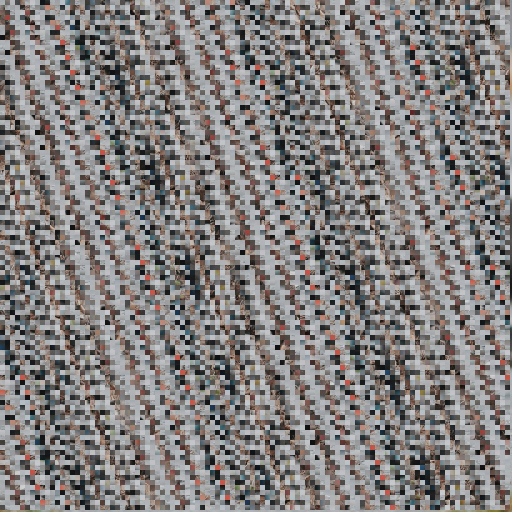

# image-crypt (AOD_ImageCrypt)

Applies reversible image-domain permutations and channel transforms, plus a corruption-tolerant visual format.

This After Effects effect provides deterministic visual encoding for motion-graphics and glitch workflows. It is not a cryptographic security product and must not be used to protect confidential information.

## Algorithms

- **Coordinate Shear** performs several keyed toroidal X/Y shears. Every pixel has a unique destination, and applying the inverse rounds restores the original coordinates.
- **Block Permutation** applies the same invertible construction to a grid of complete square tiles. Pixels inside a tile are not changed; incomplete right and bottom edge tiles remain in place.
- **Affine Channel Cipher** quantizes RGB or RGBA and applies a keyed affine permutation modulo the selected precision. Adjacent channels are coupled during each round, so a small channel change produces a visibly different encoded value.
- **Combined Legacy** composes Coordinate Shear, Block Permutation, and Affine Channel Cipher. Its popup index and behavior remain unchanged for projects created with version 0.1.0.
- **Linear Interleave** flattens the raster and applies keyed affine permutations whose multipliers are selected to be coprime with the exact pixel count. This scatters pixels across scanlines and remains reversible for arbitrary dimensions.
- **Bit-Plane Cipher** XORs keyed masks into quantized channel bit planes and rotates those planes independently. Decode reverses the rotation and mask in reverse round order.
- **Interleave + Bit-Plane** combines Linear Interleave with Bit-Plane Cipher.
- **Resilient Replicas (Lossy)** samples a lower-resolution logical raster, stores several encrypted copies of every logical pixel, and scatters the copies with Linear Interleave. Decode decrypts all available copies and takes a per-channel median. Limited edited or damaged pixels can therefore be ignored when intact copies remain in the majority.

## Matching Encode and Decode

Set **Operation** to Encode for the first instance and Decode for the matching second instance. The algorithm, four key words, rounds, algorithm-specific controls, frame dimensions, and host bit depth must match.

The exact reversible algorithms require an unchanged encoded buffer between the two instances: resizing, resampling, cropping, color conversion, lossy rendering, or pixel edits can prevent exact restoration. Channel algorithms quantize floating-point input by design. A 16-bpc integer AE world uses 15 cipher bits for Bit-Plane modes so every intermediate bit pattern remains representable; floating-point worlds can use all 16 selected bits.

## Resilient Replicas

**Recovery Redundancy** requests 1 to 15 spatial copies. Larger values tolerate more damaged copies but reduce the logical image resolution. **Recovery Interleave** controls how many keyed scattering passes separate replicas; zero keeps the replica slots in scan order.

The encoded image has the same frame dimensions, so error correction cannot add capacity without discarding some spatial detail. Resilient Replicas makes that trade explicitly: it reconstructs a nearest-neighbor version of the lower-resolution logical raster rather than the exact full-resolution source. With an odd group of `n` intact-format replicas, median decoding tolerates up to `(n - 1) / 2` arbitrary corrupted copies for that logical pixel. It is intended for isolated pixel edits and local scratches, not geometry changes, cropping, or broad color processing.

The parameter panel dynamically shows Block Size, precision/channel controls, and recovery controls only for algorithms that use them.

## Name Compatibility

The display name and installed binary were shortened from `AOD_ImageEncryptDecrypt` to `AOD_ImageCrypt`. The internal After Effects match name intentionally remains `ImageEncryptDecrypt`, so existing projects continue to resolve the effect. The old `AOD_ImageEncryptDecrypt.aex` must be removed when installing `AOD_ImageCrypt.aex`; loading both binaries would register the same internal effect twice.

## Building the Plugin

See the [main README](../../README.md) for instructions on how to build the plugin.
